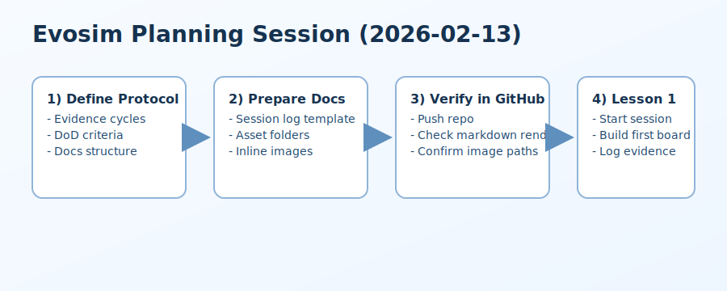

# Session Log - Planning Setup

Date: 2026-02-13  
Participants: Will (solo prep)  
Duration: ~45 minutes  
Primary goal: Prepare project protocol and documentation structure before first lesson.  
Stretch goal: Validate inline image workflow for GitHub-rendered markdown.  
Expected evidence: Commits, inline screenshot/image example, planning notes.

## Outcomes
- Refined `AGENTS.md` workflow and evidence requirements.
- Added policy to store images under `docs/session-logs/assets/YYYY-MM-DD-<slug>/`.
- Added requirement to include inline images in print-ready summaries.

## Evidence
- Protocol updates committed in `AGENTS.md` (commit pending).
- Inline image test asset added:

## Notes for First Lesson
- Start with a deterministic simulation seed and one simple movement rule.
- Keep first coding cycle tiny: one feature, one test, one commit, one screenshot.
- End with a 5-question quiz and brief recap.

## Next Session Draft
- Initialize Python project with `uv`.
- Add first simulation module and headless test.
- Add optional pygame visualization layer after logic tests pass.
