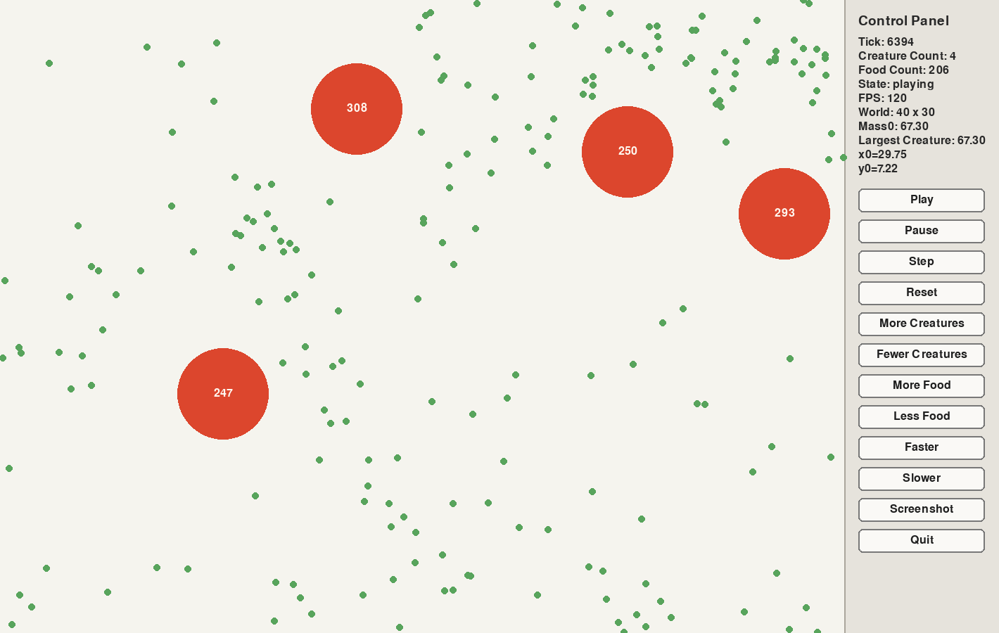
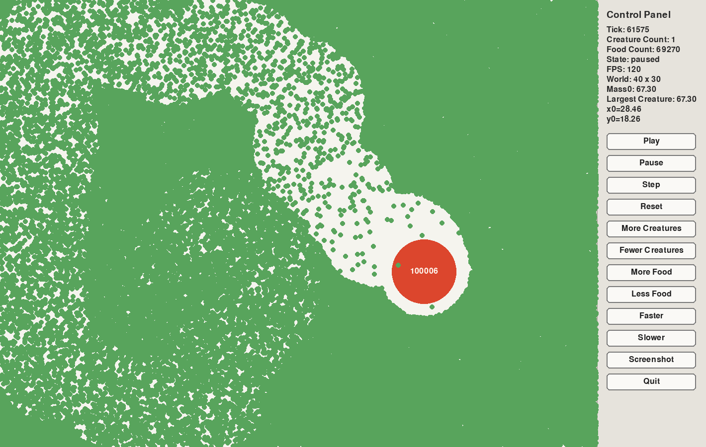

# Session Log - Creature Growth And Predation

Date: 2026-03-01  
Participants: Judah + Will + Codex  
Primary goal: Expand the simulation with food, growth, predation, and better controls.

## Outcome
- Added food pellets that respawn every 5 seconds.
- Added food and creature count buttons in the pygame control panel.
- Added keyboard modifiers for button clicks:
  `Ctrl` applies an action 10 times and `Shift` applies it 100 times.
- Added creature growth from eating food and from eating smaller creatures.
- Added per-creature number labels showing food eaten.
- Added predator and prey behavior:
  bigger-number creatures chase smaller-number creatures and smaller-number creatures flee.
- Changed creature-vs-creature size comparison to use the displayed number on the creature.
- Kept mass growth capped at 150 food eaten, while allowing the displayed number to keep increasing.
- Increased default simulation scale to start with 50 creatures and 250 respawning food pellets.

## Evidence

Caption: Creatures capped at size 150. File: `2026-03-01_144853.png`

Caption: Large creatue hits 100,000 size. File: `2026-03-01_151936.png`

## What Changed
- Simulation rules now support food seeking, prey chasing, predator avoidance, overlap eating, and inherited predator bonuses.
- Creature growth and speed slowdown are both based on food eaten, with caps for growth and slowdown.
- Creature comparisons after 150 now still use the actual displayed number, so a creature with 200 can still eat one with 170.
- The pygame panel now shows richer stats and supports large repeated actions through modifier keys.

## What Judah Should Learn
- One number in a simulation can mean different things depending on the rule:
  here, `food_eaten` is used for score and creature-vs-creature ranking, while `mass` controls visual size.
- A cap in one part of a model does not have to apply everywhere.
- UI controls become much more useful when repeated actions are supported cleanly.

## Quiz Questions
1. What is the difference between a creature's `mass` and its displayed number?
2. Why can a creature with number `200` eat a creature with number `170` even though growth stops at `150`?
3. What happens when a creature overlaps a food pellet?
4. How do `Ctrl` and `Shift` change what a button click does in the pygame control panel?
5. Why might a smaller creature run away from a bigger creature instead of moving toward food?

## Quiz Answers
1. The displayed number is the food eaten and the mass grows with a function based on food eaten stopping at 150.
2. A creature of number 200 can eat one of 170 because what determines the possibilty of eating is the number not mass.
3. When a creature overlaps a food pellet the pellet dissapears and the creature gains +1 to the display number. At first eating food increases mass by 10% but after eating 25 that goes down to 5% then down to 1% at 40 until 150 in which the creature will stop growing from food.
4. Ctrl makes the effect of each button be 10 times the original amount and Shift makes it 100 times the original.
5. A smaller creature should run away from a larger one as opposed to eating food because once you get eaten you are out of the game permenantly and staying in the game is the top priority.

## Teacher Feedback
- Judah's answers were correct overall and showed strong understanding of the simulation rules.
- One correction was needed: the `1%` growth tier starts after `40` food eaten, not `50`.

## Suggested Next Step
- Add a panel stat for top displayed number and top mass at the same time, so it is easier to compare the two systems during long runs.
